# 🔄 State Machine Diagrams — Weather App

Tài liệu mô tả **sơ đồ state machine** cho tất cả thành phần quản lý trạng thái trong ứng dụng.

---

## 📑 Mục Lục

1. [App Navigation](#1-app-navigation)
2. [WeatherNotifier](#2-weathernotifier--trạng-thái-thời-tiết-chính)
3. [SearchNotifier](#3-searchnotifier--tìm-kiếm-thành-phố)
4. [SavedCitiesNotifier](#4-savedcitiesnotifier--danh-sách-thành-phố-đã-lưu)
5. [SplashScreen Flow](#5-splashscreen--luồng-khởi-tạo)
6. [LocaleNotifier](#6-localenotifier--ngôn-ngữ)
7. [ThemeModeNotifier](#7-thememodenotifier--chế-độ-sángtối)
8. [TemperatureUnitNotifier](#8-temperatureunitnotifier--đơn-vị-nhiệt-độ)
9. [WeatherRepository Cache](#9-weatherrepository--caching-layer)
10. [SearchScreen Interaction](#10-searchscreen--luồng-tương-tác)
11. [Provider Dependency Graph](#11-provider-dependency-graph)

---

## 1. App Navigation

Luồng điều hướng giữa các màn hình chính.

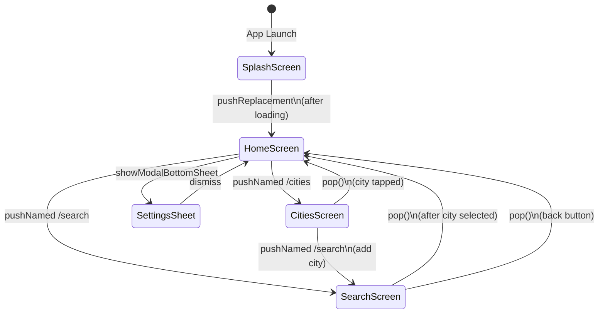

> **File:** `lib/core/app_router.dart`

---

## 2. WeatherNotifier — Trạng thái thời tiết chính

Quản lý việc tải dữ liệu thời tiết cho thành phố hiện tại.

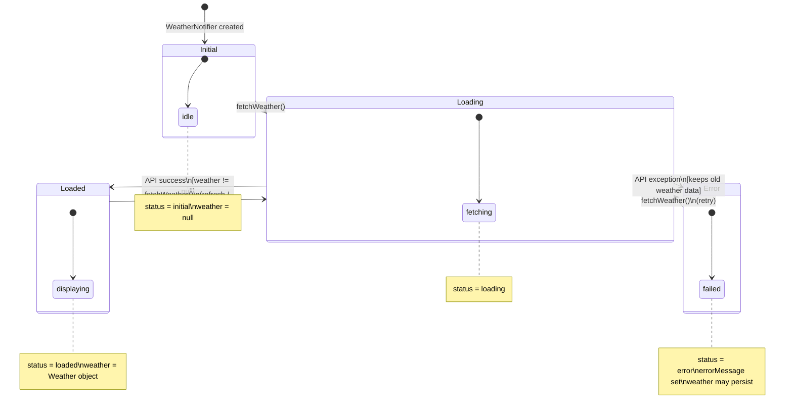

> **Provider:** `weatherNotifierProvider`
> **File:** `lib/features/weather/presentation/providers/weather_providers.dart`

---

## 3. SearchNotifier — Tìm kiếm thành phố

Quản lý trạng thái tìm kiếm thành phố qua Geocoding API.

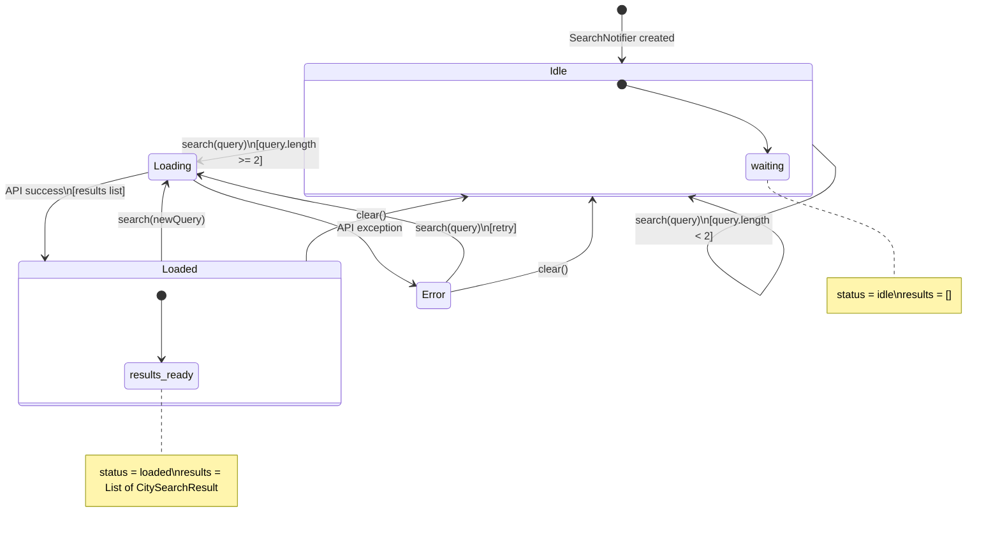

> **Provider:** `searchNotifierProvider`
> **File:** `lib/features/weather/presentation/providers/weather_providers.dart`

---

## 4. SavedCitiesNotifier — Danh sách thành phố đã lưu

Quản lý CRUD cho danh sách thành phố với persistence qua SharedPreferences.

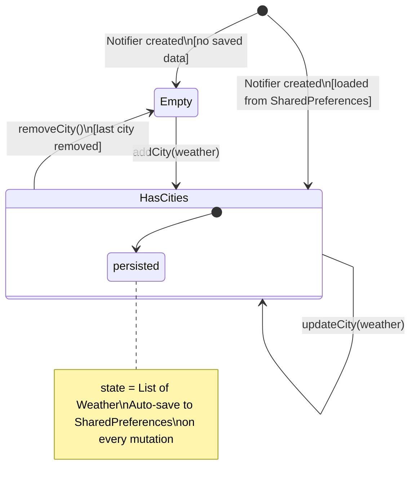

> **Provider:** `savedCitiesProvider`
> **File:** `lib/features/weather/presentation/providers/weather_providers.dart`

---

## 5. SplashScreen — Luồng khởi tạo

Logic quyết định khi khởi động ứng dụng.

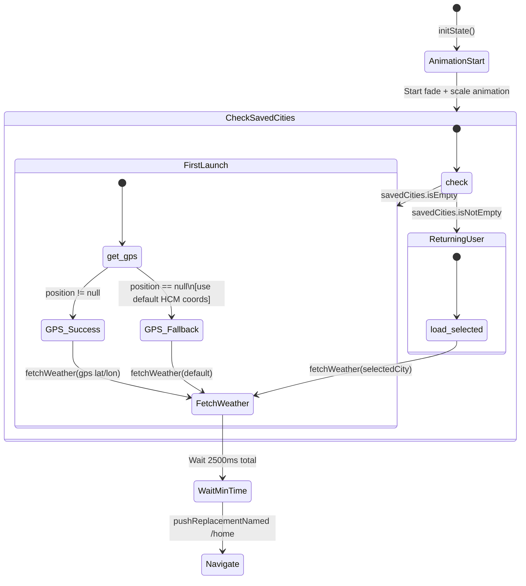

> **File:** `lib/features/weather/presentation/screens/splash_screen.dart`

---

## 6. LocaleNotifier — Ngôn ngữ

Chuyển đổi ngôn ngữ EN ↔ VI.

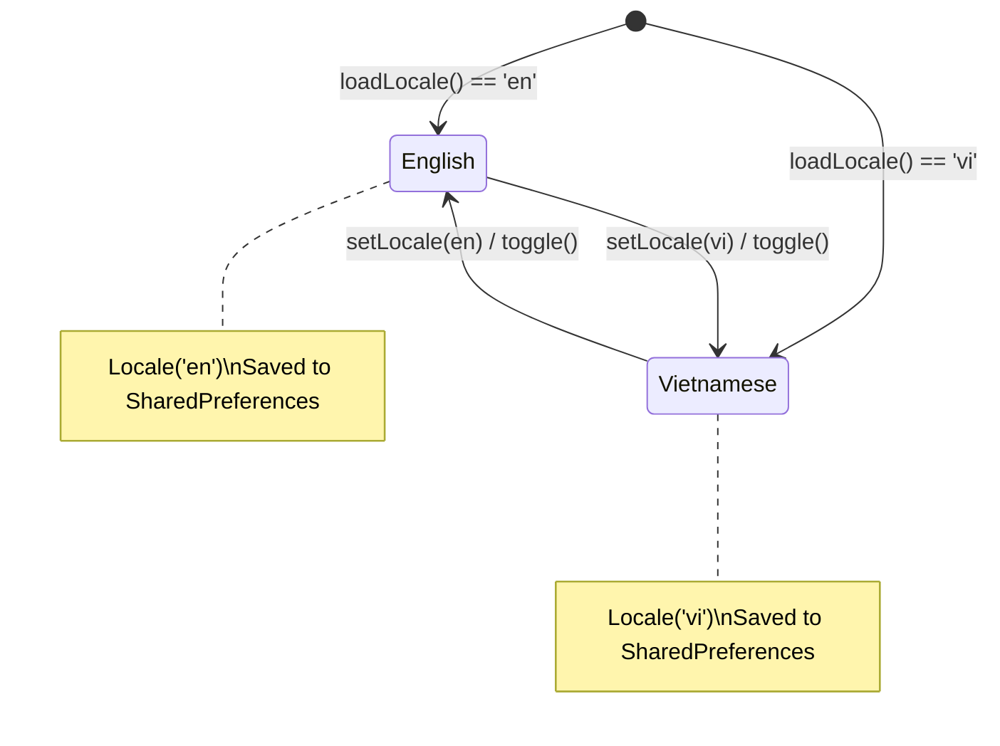

> **Provider:** `localeProvider`
> **File:** `lib/features/settings/providers/settings_providers.dart`

---

## 7. ThemeModeNotifier — Chế độ sáng/tối

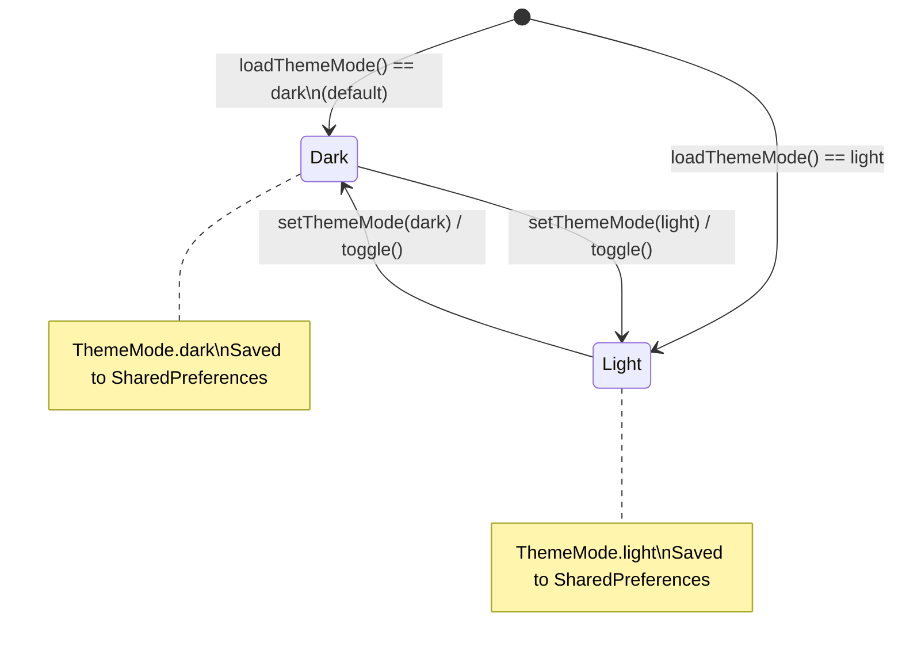

> **Provider:** `themeModeProvider`
> **File:** `lib/features/settings/providers/settings_providers.dart`

---

## 8. TemperatureUnitNotifier — Đơn vị nhiệt độ

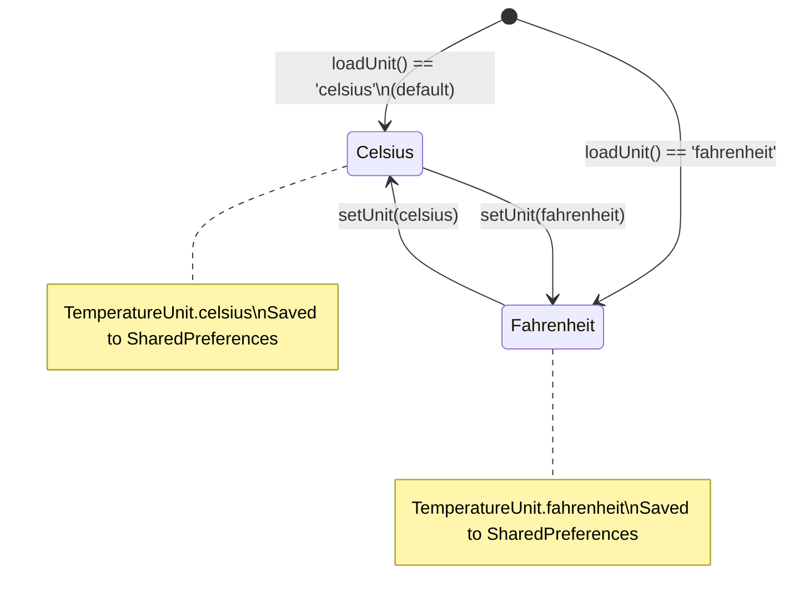

> **Provider:** `temperatureUnitProvider`
> **File:** `lib/features/settings/providers/settings_providers.dart`

---

## 9. WeatherRepository — Caching Layer

Bộ nhớ đệm trong bộ nhớ (in-memory cache) cho dữ liệu Weather API.

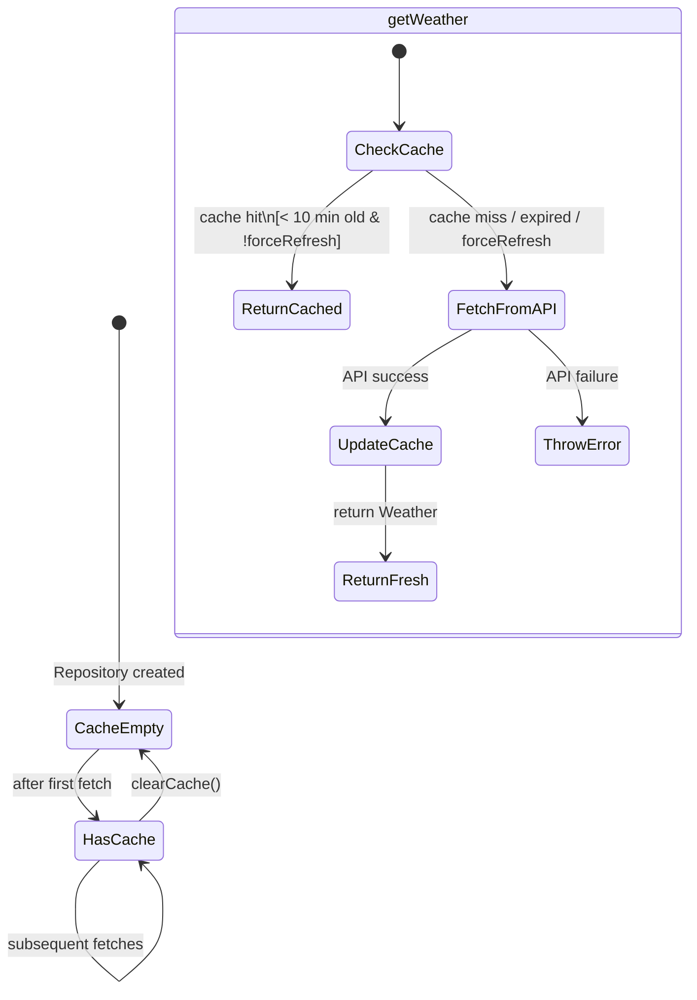

> **File:** `lib/features/weather/data/weather_repository.dart`

---

## 10. SearchScreen — Luồng tương tác

Kết hợp trạng thái UI local (`_isLoadingWeather`) và `SearchNotifier`.

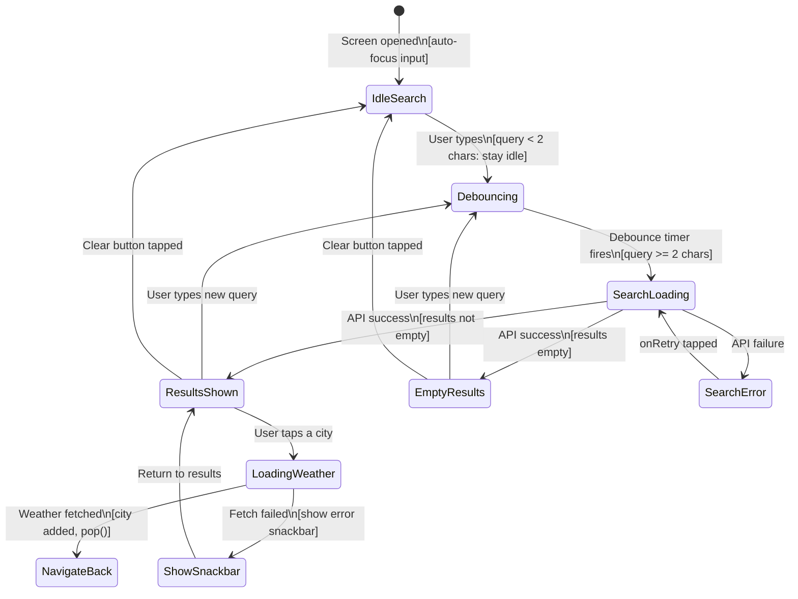

> **File:** `lib/features/weather/presentation/screens/search_screen.dart`

---

## 11. Provider Dependency Graph

Sơ đồ tổng quan cách các Provider phụ thuộc vào nhau.

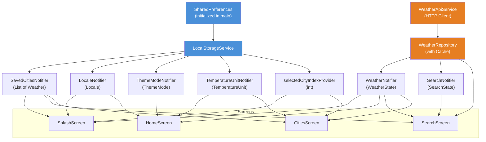

---

## 📄 Ghi Chú

- Tất cả sơ đồ sử dụng **Mermaid** — có thể render trực tiếp trên GitHub, GitLab, hoặc bất kỳ markdown viewer nào hỗ trợ Mermaid.
- Mỗi `StateNotifier` persist trạng thái qua `SharedPreferences` thông qua `LocalStorageService`.
- `WeatherRepository` sử dụng in-memory cache với TTL 10 phút, có thể bypass bằng `forceRefresh: true`.
